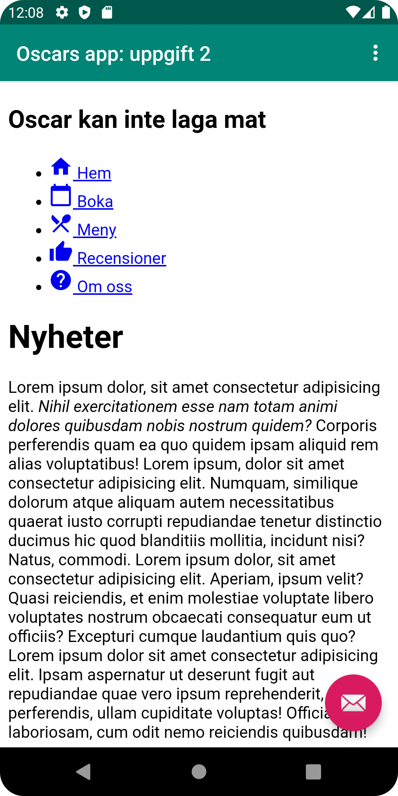

# Rapport

Här gjorde jag det möjligt för appen att använda sig av internet.
```
<uses-permission android:name="android.permission.INTERNET" />
```

Här skapar vi en WebView variabel som refererar till ett WebView-element. Vi skapar en webviewclient som enablear javascript.
```
private WebView myWebView;

-||- 

myWebView = findViewById(R.id.my_webview);
myWebView.setWebViewClient(new WebViewClient()); 
myWebView.getSettings().setJavaScriptEnabled(true);
```

Dessa två funktioner körs beroende på ifall man har "External" eller "Internal" valt. Den ena laddar en extern sida och den andra en intern fil med html kod.
```
    public void showExternalWebPage(){
        myWebView.loadUrl("https://his.se");
    }

    public void showInternalWebPage(){
        myWebView.loadUrl("file:///android_asset/about.html");
    }
```

Här skapar vi ett webview element med id "my_webview".
```
<WebView
    android:id="@+id/my_webview"
    android:layout_width="match_parent"
    android:layout_height="match_parent"/>
```


Bilder läggs i samma mapp som markdown-filen.




Läs gärna:

- Boulos, M.N.K., Warren, J., Gong, J. & Yue, P. (2010) Web GIS in practice VIII: HTML5 and the canvas element for interactive online mapping. International journal of health geographics 9, 14. Shin, Y. &
- Wunsche, B.C. (2013) A smartphone-based golf simulation exercise game for supporting arthritis patients. 2013 28th International Conference of Image and Vision Computing New Zealand (IVCNZ), IEEE, pp. 459–464.
- Wohlin, C., Runeson, P., Höst, M., Ohlsson, M.C., Regnell, B., Wesslén, A. (2012) Experimentation in Software Engineering, Berlin, Heidelberg: Springer Berlin Heidelberg.
